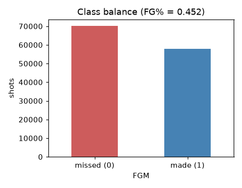
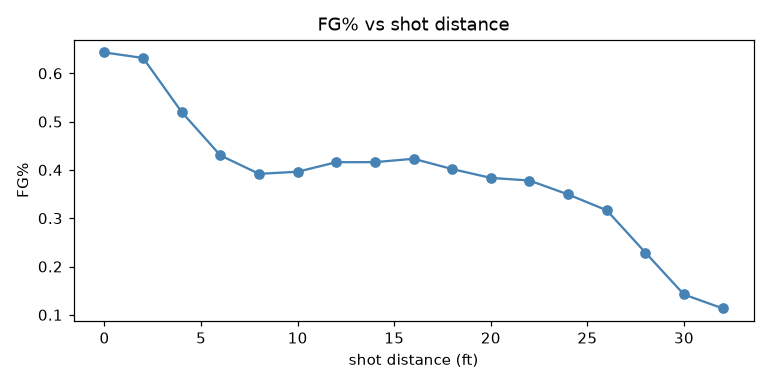
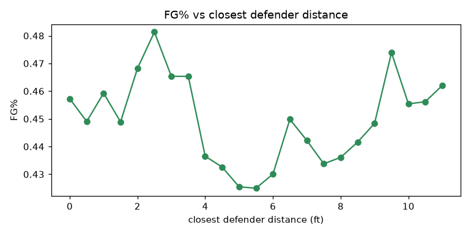
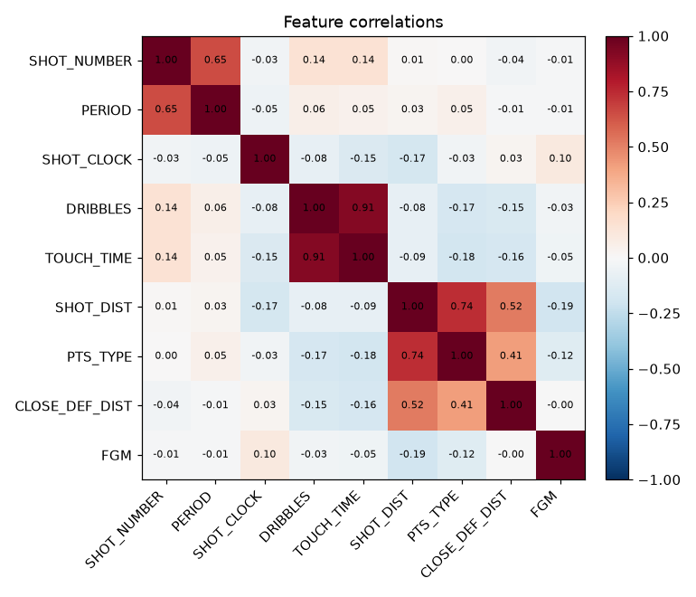

# NBA shot predictor

A neural network built from scratch in NumPy that predicts whether an NBA field goal attempt is made or missed. The network, its forward and backward passes, and the optimizer are all written by hand. There is no PyTorch, TensorFlow, Keras, or scikit-learn in the model itself. Those libraries appear only for the train/test split and as external baselines when measuring the accuracy ceiling.

The task is binary classification: given the context of a shot (distance, defender proximity, shot clock, who took it, and so on), predict `FGM`, where 1 is a made shot and 0 is a miss.

## Repository layout

```
assets/
  raw/shot_logs.csv          # original dataset
  processed/                 # cleaned, split, encoded CSVs + artifacts.pkl
  images/                    # figures used in this README
notebooks/
  01_explore.ipynb           # data exploration and visualization
  02_clean_dataset.ipynb     # cleaning, feature engineering, splitting
  03_model.ipynb             # the from-scratch neural network
  04_accuracy_xgb.ipynb      # XGBoost ceiling check
```

## The dataset

The raw data is `assets/raw/shot_logs.csv`, a log of 128,069 shot attempts with 21 columns per shot. Each row records one attempt and its outcome.

The classes are close to balanced. Across the whole dataset 45.2% of attempts are made, so a model that always predicts "miss" would be right 54.8% of the time. That number is the floor any useful model has to beat.



## Cleaning and feature engineering

The cleaning steps live in `notebooks/02_clean_dataset.ipynb`.

### Columns removed

Eight columns are dropped. `SHOT_RESULT` and `PTS` record the outcome directly, so keeping them would leak the answer into the features. `FINAL_MARGIN` and `W` describe how the whole game ended, which is not known at the moment of the shot. `GAME_ID` and `MATCHUP` are identifiers with no predictive content on their own, and `CLOSEST_DEFENDER` and `player_name` are name strings whose numeric IDs are kept instead.

### Fixes and encodings

- `LOCATION` is mapped from away/home (`A`/`H`) to 0/1, and `PTS_TYPE` from 2/3 point attempts to 0/1.
- `GAME_CLOCK` is parsed from `MM:SS` text into seconds.
- `SHOT_CLOCK` is missing when the shot clock was off late in a period. Those gaps are filled with 24, the reset value.
- `TOUCH_TIME` contains impossible negative values. It is clipped to the range 0 to 24 seconds, and remaining gaps are set to 0.

### Engineered features

Four features are added to give the model non-linear structure it would otherwise have to discover on its own:

- `SHOT_DIST_SQR`: shot distance squared, since make rate falls off non-linearly with distance.
- `DIST_X_DEF`: shot distance multiplied by defender distance.
- `OPENESS`: shot distance divided by defender distance plus one, a rough measure of how open the shooter was.
- `CATCH_SHOOT`: 1 when the shooter took zero dribbles.

`OPENESS`, `DIST_X_DEF`, and `CLOSE_DEF_DIST` are positive and right-skewed, so each is passed through `log1p` to compress large values and spread out small ones.

### Splitting, target encoding, and scaling

The data is split 80/10/10 into train, dev, and test sets, stratified on the target so all three keep the same 45.2% make rate. Every step that learns from the data is fit on the training set alone and then applied to dev and test.

Two columns, `player_id` and `CLOSEST_DEFENDER_PLAYER_ID`, have too many distinct values to one-hot encode. They are target encoded: each ID is replaced by that player's average make rate in the training set. A player with only a few shots would give a noisy average, so each estimate is smoothed toward the global mean with a weight of 20 shots. IDs that never appear in training fall back to the global mean on dev and test.

Finally the numeric columns are standardized to zero mean and unit variance using statistics computed on the training set.

The result is six CSV files in `assets/processed/` holding 16 features across 102,456 training rows, 12,806 dev rows, and 12,807 test rows. The encoders, scaler statistics, global mean, and feature order are saved to `artifacts.pkl` so the same transform can be replayed on new data.

## Exploration and relationships

`notebooks/01_explore.ipynb` checks distributions, looks for impossible values, and asks which features actually separate makes from misses.

Shot distance is the clearest signal. Make rate is highest right at the rim, drops sharply through the mid-range, and flattens out past the three-point line.



Defender distance matters in the expected direction, with more space producing a higher make rate, but the effect is weak and noisy once the defender is more than a few feet away.



The correlation heatmap explains why this is a hard problem. No single numeric feature is strongly correlated with the target. Shot distance leads at about -0.19, points type follows at -0.12, and everything else sits near zero. The features carry real but faint signal, and most of it overlaps.



## The model

`notebooks/03_model.ipynb` contains the network. Everything is NumPy.

- Architecture: an input layer of 16 features, hidden layers of 128, 64, and 32 units, and a single sigmoid output.
- Hidden layers use ReLU, with He initialization on the weights.
- The loss is binary cross-entropy.
- Forward propagation, backward propagation, and the parameter update are all implemented directly.

### Optimizer and regularization

Training uses AdamW, meaning Adam with decoupled weight decay. Adam keeps a running estimate of the first and second moments of each gradient, applies bias correction, and scales the step by the inverse square root of the second moment. The weight decay is applied directly to the weights rather than added to the gradient, which is the form current frameworks use in their `AdamW` optimizers. Biases are not decayed.

### Training loop

The training set is shuffled every epoch and split into minibatches of 128. Dev loss is checked after each epoch. The best weights seen so far are kept, and training stops when dev loss fails to improve for 10 consecutive epochs, at which point the best weights are restored.

Early stopping matters here because the model starts to overfit quickly. Train loss keeps falling while dev loss turns upward within the first few epochs, so without early stopping the final weights would generalize worse than the ones from epoch zero. In practice training stops around epoch 15 with dev accuracy near 0.61.

## The accuracy ceiling

A natural question is whether 61% is a limitation of the hand-written network or a limit of the data. `notebooks/04_accuracy_xgb.ipynb` answers it by running XGBoost, a strong gradient-boosted tree model from a completely different family, on the same processed data with early stopping on the dev set.

| model | dev accuracy | dev log loss |
|-------|-------------|--------------|
| always predict "miss" | 0.5479 | n/a |
| logistic regression | 0.6025 | 0.6607 |
| gradient boosting (scikit-learn) | 0.6139 | 0.6506 |
| XGBoost | 0.6149 | 0.6496 |
| this neural network | ~0.609 | 0.6537 |

A linear model, a from-scratch neural network, and two tree ensembles all land within half a point of each other near 61%. When models this different agree, the number describes the data rather than any one model.

The most telling figure is XGBoost's training accuracy of 0.6363. Boosted trees overfit aggressively when there is signal to overfit to, yet this one cannot push past about 64% even on data it is allowed to memorize. That means the classes genuinely overlap in feature space, so the irreducible error is high. Whether a shot goes in depends heavily on factors these 16 features do not capture, such as the exact contest, shooter rhythm, and plain chance.

The practical conclusion is that roughly 61% dev accuracy is the ceiling for this feature set. Tuning the architecture, the learning rate, or the number of epochs will move the result by fractions of a percent at most. Raising the ceiling would require more informative inputs, for example defender contest quality, shot clock pressure in finer detail, shooter fatigue, or player identity learned through embeddings, rather than a different or larger model.

## Reproducing

Run the notebooks in order: `01_explore`, `02_clean_dataset`, `03_model`, then `04_accuracy_xgb`. The model notebook needs only NumPy and pandas. The cleaning notebook also uses scikit-learn for the split, and the ceiling notebook needs XGBoost, which on macOS also requires the OpenMP runtime (`brew install libomp`).
